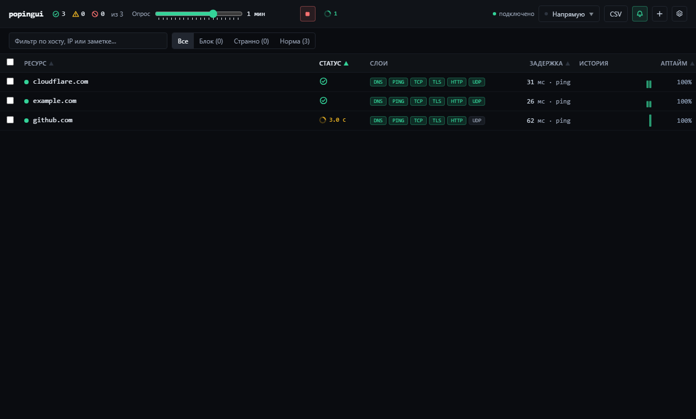

<div align="center">

# popingui

**Bulk availability monitoring that explains how a connection is failing**

DNS · PING · TCP · TLS/SNI · HTTP · UDP/QUIC

[Русский](README.md) · [Download for Windows](../../releases/latest) · [Detailed methodology](docs/methodology.ru.md)

</div>



A regular ping cannot explain why a website does not open. popingui checks six network
layers and produces an actionable diagnosis: DNS tampering, IP/port filtering, an
SNI-triggered TLS reset, certificate interception, an HTTP block page, missing expected
content, or a UDP/QUIC problem.

## Features

- bulk import of hostnames, URLs, and `host:port` targets;
- per-target layer selection;
- continuous polling with configurable interval, timeout, and concurrency;
- latency history, uptime, and detailed results for every layer;
- direct, SOCKS4a, SOCKS5, and HTTP CONNECT routes;
- UDP through SOCKS5 UDP ASSOCIATE;
- certificate identity and expiry, real SNI, and expected-page text checks;
- Windows notifications only when health changes;
- tray summary and controls;
- CSV and JSON export;
- per-user installer and portable executable.

## Install

Open **Releases** and download either:

- `popingui-<version>-x64.exe` — an NSIS installer with a selectable directory;
- `popingui-<version>-portable.exe` — a self-contained portable build.

The binaries are not code-signed yet, so SmartScreen may display a warning. Every
release includes `SHA256SUMS.txt` for integrity verification.

## Diagnostic methodology

| Layer | Method | What it establishes |
|---|---|---|
| DNS | compare system `getaddrinfo` with DNS-over-HTTPS | an unusable system answer while DoH works indicates resolver interference |
| PING | system ICMP directly; target response inside a TCP tunnel through a proxy | reachability and a value close to RTT; missing ICMP alone is never treated as blocking |
| TCP | connect to the selected address and port | a timeout while the host is reachable suggests IP/port filtering |
| TLS | handshake with real SNI, certificate identity and expiry inspection | a reset after TCP suggests SNI DPI; an alien certificate suggests interception |
| HTTP | `GET`, status, redirect, and body analysis | block pages, foreign redirects, and missing expected content |
| UDP | protocol-aware DNS/STUN/QUIC probes | UDP reachability; silent QUIC is suspicious only when `alt-svc: h3` was advertised |

Different DNS answers are normal for CDNs, so an address mismatch alone is not a
verdict. popingui performs a control connection through the DoH address. TLS and HTTP
run only on appropriate ports. UDP uses protocol-aware messages; QUIC uses a 1200-byte
Version Negotiation probe.

Proxy latency does not mistake a local proxy's quick CONNECT response for target RTT.
The tunnel is established separately and the timed payload forces the remote endpoint
to react. The [detailed Russian methodology](docs/methodology.ru.md) documents the
algorithms, verdicts, UI, and limitations.

## Development

Windows and Node.js 22.12+ are required; CI uses Node.js 22.

```powershell
npm ci
npm run dev        # server :8787 + Vite :5273
npm run app        # Electron with hot reload
npm run typecheck
npm run check      # 12 local regression checks
npm run app:build  # NSIS + portable in release/
```

Tests do not depend on the public internet. They create dedicated DNS, HTTP, TLS, QUIC,
and proxy services on loopback. See [`.ai/verification.md`](.ai/verification.md) for the
evidence behind every check.

## Architecture

```text
Electron main ──┬── BrowserWindow ── React UI
                ├── Tray                 │
                └── Monitor ◄──── REST + WebSocket
                       ├── scheduler
                       ├── layered probe
                       ├── proxy / UDP transports
                       └── JSON persistence
```

`Monitor` is the single owner of state. In packaged builds the server runs inside the
Electron main process and listens on `127.0.0.1` only. Shared TypeScript types define the
UI/server/tray contract. See [architecture](.ai/architecture.md).

## Limitations

- results describe observed network behaviour, not the legal cause of a restriction;
- many hosts disable ICMP, which does not prove blocking;
- system PAC scripts are intentionally not executed;
- unsigned builds may trigger SmartScreen.

## License

This project is distributed under the [MIT License](LICENSE). Use, modification, and
distribution—including commercial use—are permitted as long as the copyright notice
and license text are retained. The software is provided without warranty.

## Releases

A `v*` tag runs the Windows workflow: clean install, typecheck, all checks,
NSIS/portable build, SHA-256 generation, and GitHub Release upload. See
[`RELEASE.md`](RELEASE.md) and [`CHANGELOG.md`](CHANGELOG.md).
